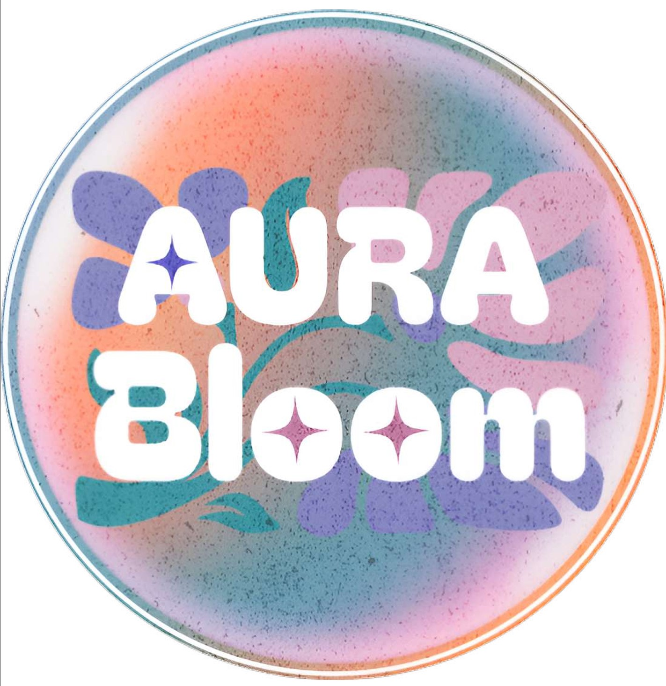

<h1 align="center">
  
   
  🌸 AuraBloom 🌸
</h1>

<i>An AI-Driven Beauty Exploration System Powered by Computer Vision and Recommender Systems</i>

---

<h2>✨ Overview</h2>

AuraBloom combines advanced imaging techniques and recommendation algorithms to enhance user confidence and personal style. By leveraging machine learning, it provides personalized makeup and seasonal color palette recommendations based on user-uploaded images and preferences.

---

<h2>🛠️ Features</h2>

<h3>1. Skin Tone Detection & Classification</h3>
<ul>
  <li>Achieves <b>80% accuracy</b> in skin tone classification.</li>
  <li>Uses face detection, skin segmentation, and dominant tone extraction.</li>
  <li>Powered by X-means clustering and LAB-based Delta E metrics for precision.</li>
</ul>

<h3>2. Personalized Makeup Recommendations</h3>
<ul>
  <li>Provides tailored recommendations based on individual skin tones.</li>
  <li>Analyzes user-uploaded images to suggest complementary products.</li>
</ul>

<h3>3. Seasonal Color Palette Recommendations</h3>
<ul>
  <li>Combines features like:
    <ul>
      <li>Skin tone</li>
      <li>Eye color</li>
      <li>Hair color</li>
      <li>Skin undertones (detected through vein analysis)</li>
    </ul>
  </li>
  <li>Uses <b>seasonal color theory</b> to generate custom palettes.</li>
</ul>

<h3>4. Hair & Iris Color Classification</h3>
<ul>
  <li>Identifies dominant hair and eye colors with clustering techniques.</li>
  <li>Utilizes advanced color space transformations for accuracy.</li>
</ul>

---

<h2>🧠 Technical Overview</h2>
<ul>
  <li><b>Skin Tone Classification</b>: Foundational to both makeup and color palette recommendations, leveraging advanced imaging and ML techniques for reliable results.</li>
  <li><b>Machine Learning</b>: Employed for clustering, color analysis, and feature extraction to deliver tailored outcomes.</li>
  <li><b>Knowledge-Based Recommender Models</b>: 
    Utilize user-provided inputs such as preferences, skin tone, hair color, and seasonal palette preferences to provide highly personalized recommendations.  
    This approach ensures accurate, user-centric suggestions even without extensive historical data.</li>
</ul>

---

<h2>🌟 Impact</h2>

AuraBloom demonstrates the power of AI in transforming beauty and fashion by delivering <b>reliable</b>, <b>accurate</b>, and <b>personalized recommendations</b>. This innovative system empowers users to explore and master their unique style.

---

<h2 align="center">🎨 Made with 💻 and ❤️ by AuraBloom Team</h2>
<ul>
  <li><b>Rimas Alshehri</b></li>
  <li><b>Taif Alharbi</b></li>
  <li><b>Rama Alyoubi</b></li>
  <li><b>Yara Alshehri</b></li>
  <li><b>Albatul Alghamdi</b></li>
  <li><b>Gharam Badroon</b></li>
</ul>
